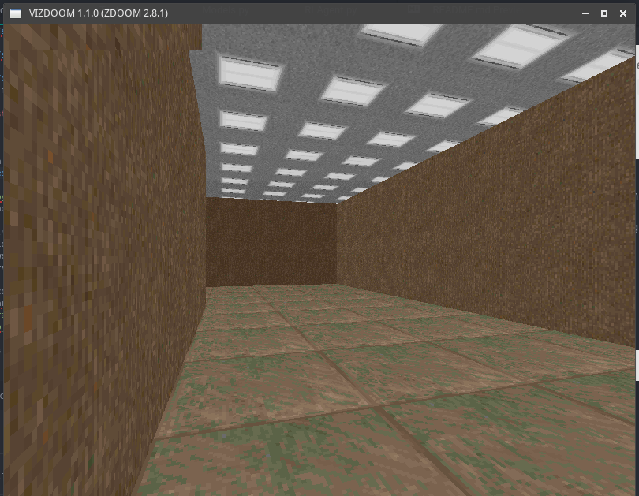

# DeepDoom: Navigating Complex Environments Using Heirarchical Deep Q-Networks


**Last Updated: March 3, 2016**

**Team:**

- [Rafael Zamora](https://github.com/rz4) - Team Leader, Lead Programmer, Machine Learning Specialist
- [Lauren An](https://github.com/AtlasSoft-lsa3) - Programmer, Head of Testing
- [William Steele](https://github.com/billionthb) - Programmer, Hardware Specialist, Head of Documentation
- [Joshua Hidayat](https://github.com/Arngeirr) - Programmer, Head of Data Gathering

## Introduction

## DQN and Heirarchical-DQN


## Scenarios

We designed a set of scenarios where the agent will learn specific behaviors. These
scenarios where created using Doom Builder and ViZDoom. The following are descriptions of
the scenarios:

---

### Scenario 1 : Rigid Turning


#### Description:
The purpose of this scenario is to train the AI on navigating through corridors with sharp 90° turns. Map is a rigid S-shape with wall and floor textures that are randomly determined at the time of loading the map. The player gets rewarded for navigating from one end of the 'S' to the other, and gets penalized for bumping into walls and not moving.

*Available Actions* : [MOVE_FORWARD, MOVE_BACKWARD, TURN_LEFT, TURN_RIGHT]

This set of action are the minimum required to reach the level exit for this scenario.

##### Goal Function:

- **+50** reward checkpoints
- **+100** level exit
- **-10** hitting walls
- **-1** living reward

##### Files:
- [rigid_turning.wad](src/wads/rigid_turning.wad)
- [rigid_turning.cfg](src/configs/rigid_turning.cfg)

---

### Scenario 2 : Exit Finding


#### Description:
This scenario is designed to train the AI to spot an exit from a room, in the form of a
hallway branching off this room, and move into that exit. Map is a square room where
player starts in, with long 128-unit-wide corridor leading out of it. Player is
randomly placed at a point inside the square starting room by a ZDoom ACS script that
runs when player enters the map. The textures of the walls and floors are selected
randomly by another ACS script from a pool of predefined textures. The player is
rewarded for moving closer to the exit while looking at it (the exit is within a 21.6°
field of view relative to player's direction). The player does not receive any reward
for moving towards the exit while not looking at it. The player is penalized for
bumping into walls and not moving.

*Available Actions* : [MOVE_FORWARD, MOVE_BACKWARD, TURN_LEFT, TURN_RIGHT]

This set of action are the minimum required to reach the level exit for this scenario.

##### Goal Function:

- **+50** reward checkpoints
- **+100** level exit
- **-10** hitting walls
- **-1** living reward

##### Files:
- [exit_finding.wad](src/wads/exit_finding.wad)
- [exit_finding.cfg](src/configs/exit_finding.cfg)

---

## Results:

N/A

## Getting Started

### Requirements:

Requires Python 3.5.

Requires the following Python Packages:

- [ViZDoom](https://github.com/Marqt/ViZDoom)

- [Keras](https://github.com/fchollet/keras)

- [TensorFlow](https://tensorflow.org/)

- [H5Py](https://h5py.org/)

- [Matplotlib](http://matplotlib.org/)

### Setup and Installation:

Download or clone repository and install required packages.

>**Important:** keras.json configuration file (located in ~/.keras/) should be set to
>the following:

```json
{
    "floatx": "float32",
    "epsilon": 1e-07,
    "backend": "tensorflow",
    "image_dim_ordering": "th"
}
```

**Wads, Vizdoom Configs, and Model Weights:**

The [`/src/wads/`](src/wads) folder contains the `.wad` for the scenarios.

The [`/src/configs/`](src/configs) folder contains the `.cfg` files for the scenarios.

The [`/data/model_weights`](data/model_weights) folder contains trained .h5 model
weight files.

### Testing Models:

>*Model Weights currently unavailable*

You can test out the different trained models by changing the testing parameters
in [`Test.py`](src/Test.py):

`Test.py`
```python

# Testing Parameters
scenario = 'configs/rigid_turning.cfg'  # Vizdoom Scenario
model_weights = "rigid_turning.h5"      # DQN Model Weights .h5 file
depth_radius = 1.0                      # Depth Buffer Radius (recommended to keep at 1.0)  
depth_contrast = 0.9                    # Depth Buffer contrast on Greyscaled image
test_param = {
    'frame_skips' : 6,                  # Number of frames same action
    'nb_frames' : 3                     # Number of previous frames model uses
}
nb_runs = 10                            # Number of Testing runs done on model

```
> **Caution:** Certain `model_weight` files are not compatible with specific scenarios.
> Also, make sure `nb_frames` are compatible with *model_weight* file.

From [`/src/`](src) run [`Test.py`](src/Test.py):

```
$python3 Test.py
Using TensorFlow backend.
Testing DQN-Model: rigid_turning.h5

Running Simulation: configs/rigid_turning.cfg
 66%|█████████████████████████▌             | 197/300 [00:01<00:00, 160.48it/s]
Total Score: 1209.0

Running Replay: test.lmp
Total Score: 1209.0

```
The following is a screenshot of VizDoom `test.lmp` replay:

