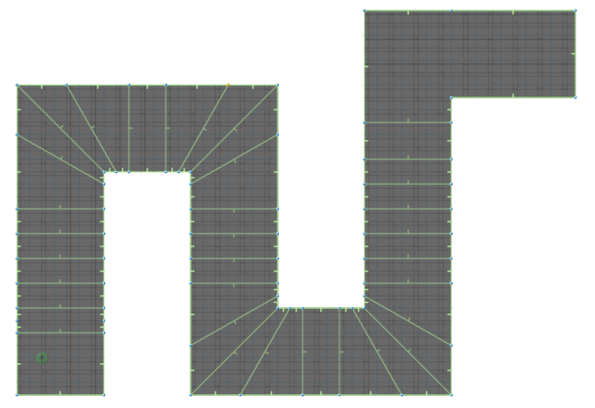
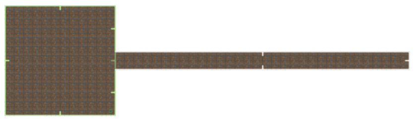
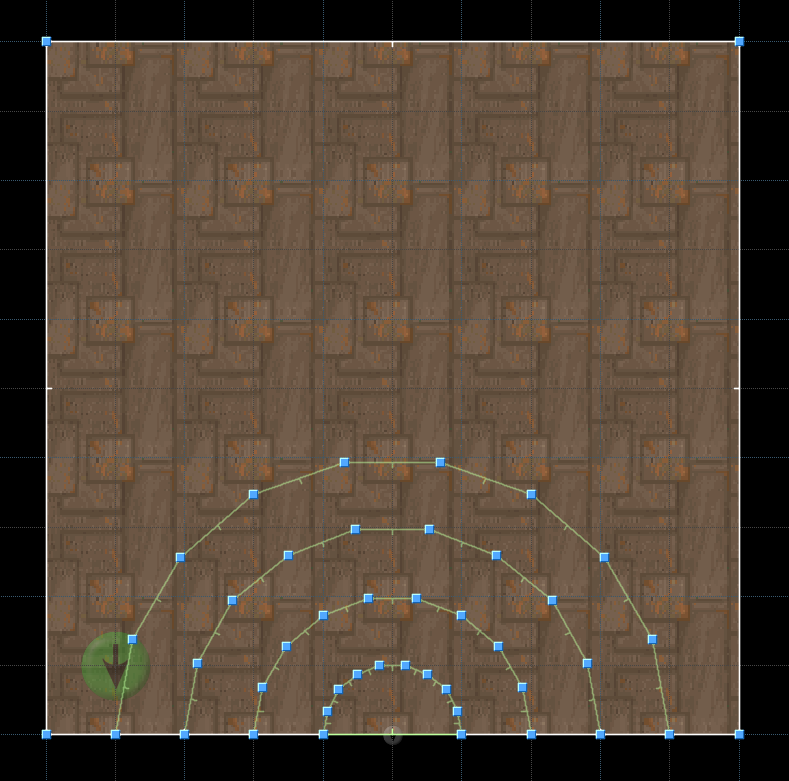
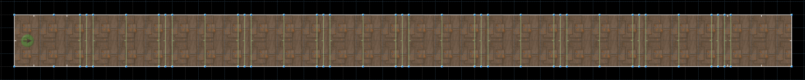
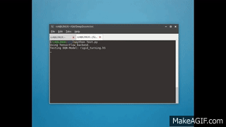

# DeepDoom: Navigating Complex Environments Using Hierarchical Deep Q-Networks


**Last Updated: March 3, 2016**

**DeepDoom Team:**

- [Rafael Zamora](https://github.com/rz4) - Team Leader, Lead Programmer, Machine Learning Specialist
- [Lauren An](https://github.com/AtlasSoft-lsa3) - Programmer, Head of Testing
- [William Steele](https://github.com/billionthb) - Programmer, Hardware Specialist, Head of Documentation
- [Joshua Hidayat](https://github.com/Arngeirr) - Programmer, Head of Data Gathering

### Table of Contents:
1. [Introduction](#introduction)
2. [DQN and Hierarchical DQN](#dqn-and-hierarchical-dqn)
3. [Scenarios](#scenarios)
 - [Rigid Turning](#scenario-1--rigid-turning)
 - [Exit Finding](#scenario-2--exit-finding)
 - [Switches](#scenario-3--switches)
 - [Doors](#scenario-4--doors)
4. [Results](#results)
5. [Getting Started](#getting-started)

## Introduction

Google DeepMind's landmark paper, [***Playing Atari With Deep Reinforcement
Learning***](https://www.cs.toronto.edu/~vmnih/docs/dqn.pdf), shows the feasibility of
game playing using only visual input. This was
done by combining Deep Convolutional Neural Networks (CNNs) with Q-learning. Deep
Q-Networks (DQNs) were able to learn and play 2D Atari-2600 games such as Pong, Breakout, and Space
Invaders. Since then, there has been much research into applying these same techniques in 3D
environments such as [Minecraft](https://www.ijcai.org/Proceedings/16/Papers/643.pdf)
and Doom.

[ViZDoom](https://arxiv.org/pdf/1605.02097.pdf) is a Doom based AI research platform
which allows us to test reinforcement learning techniques in Doom's 3D environment.
ViZDoom's Visual Doom AI Competition shows that AIs can be taught to play sufficiently
in the Doom environment using DQNs.

[Previous research](https://arxiv.org/pdf/1609.05521.pdf) done using ViZDoom has mainly
focused on combat with only a minor focus on navigation (*item/health pickups*). Navigation
is an important part in playing Doom, especially in single-player instances of the game.
Levels designed for human players are complex, requiring the player to use multiple
navigational behaviors throughout the level.

We propose a [hierarchical implementation](https://arxiv.org/pdf/1604.07255.pdf) of the Deep 
Q-Networks in order to solve complex navigational problems. DQN models are trained on simple 
tasks and are then integrated as sub-models in a Hierarchical-DQN model. This allows knowledge 
learned from simple tasks to be used for more complex tasks.

## DQN and Hierarchical-DQN
> Under Construction

## Scenarios

We designed a set of scenarios where the agent will learn specific behaviors. These scenarios were created using Doom Builder v2.1+ and ViZDoom v1.1+. Reward functions are defined via the Doom Builder Script Editor using the Action Code Script (ACS) scripting language. For a quick tutorial, [click here](https://zdoom.org/wiki/ACS).

>***Note: living rewards are defined within the ViZDoom config file.***

The following are descriptions of the scenarios:

---

### Scenario 1 : Rigid Turning


#### Description:
 - The purpose of this scenario is to train the AI on navigating through corridors with sharp 90° turns.
 - The map is a rigid 2-shape, with randomly determined ceiling, floor, and wall textures at the time of loading the map.
 
 - The player is placed at one end of the '2' and is expected to navigate through this shape.
 
 - The player gets rewarded for walking down a corridor and turning a 90° corner.
 - The player gets penalized for bumping into walls and not moving.

#### Available Actions:
 - [MOVE_FORWARD, MOVE_BACKWARD, TURN_LEFT, TURN_RIGHT]
 - This set of actions is the minimum required to complete the rigid turning scenario.

#### Goal Function:

 - **+60** turning linedefs - for turning a 90° corner
 - **+20** walking linedefs - for walking down a corridor
 
 - **+100** level exit - for completing the level
 - **+1** moving reward - changes in the player's x,y position to encourage continual movement

 - **-10** hitting the walls - for aimlessly bumping into the walls
 - **-1** living reward - ViZDoom config file penalty to encourage faster level completion

#### Files:
 - [rigid_turning.wad](src/wads/rigid_turning.wad)
 - [rigid_turning.cfg](src/configs/rigid_turning.cfg)

---

### Scenario 2 : Exit Finding


#### Description:
 - The purpose of this scenario is to train the AI on locating an exit from a room and move towards that exit, which is merely a long hallway branching off of the room.
 - The map is a square room with a long 128-unit-wide corridor leading out of it and randomly determined ceiling, floor, and wall textures at the time of loading the map.
 
 - The player is placed at a random point inside the room and facing a random direction via a ZDoom ACS script that runs when the player enters the map.
 
 - The player gets rewarded for moving towards the exit when it is within a 21.6° field of view relative to the player's direction; therefore, the player does not get rewarded for moving towards the exit while facing away.
 - The player gets penalized for bumping into walls and not moving.

#### Available Actions:
 - [MOVE_FORWARD, MOVE_BACKWARD, TURN_LEFT, TURN_RIGHT]
 - This set of actions is the minimum required to complete the exit finding scenario.

#### Goal Function:

 - **+10 * (x)** exit linedefs - for moving closer to the goal while looking at it
 
>***Note: x inversely corresponds to the switch's distance; x decreases as distance increases.***

 - **+100** level exit - for completing the level
 - **+1** moving reward - changes in the player's x,y position to encourage continual movement

 - **-10** hitting the walls - for aimlessly bumping into the walls
 - **-1** living reward - ViZDoom config file penalty to encourage faster level completion

#### Files:
 - [exit_finding.wad](src/wads/exit_finding.wad)
 - [exit_finding.cfg](src/configs/exit_finding.cfg)

---

### Scenario 3 : Switches


#### Description:
 - The purpose of this scenario is to train the AI on locating a switch on the wall.
 - The map is a square room with a button placed on the south wall and randomly determined ceiling, floor, and wall textures at the time of loading the map.
 
 - The player is placed at a random point inside the room and facing a random direction via a ZDoom ACS script that runs when the player enters the map.
 
 - The player gets rewarded for moving towards the switch when it is within a 21.6° field of view relative to the player's direction; therefore, the player does not get rewarded for moving towards the exit while facing away.
 - The player gets penalized for not moving.

#### Available Actions:
 - [USE, MOVE_FORWARD, MOVE_BACKWARD, TURN_LEFT, TURN_RIGHT]
 - This set of actions is the minimum required to complete the switches scenario.
 
>***Note: the USE action is defined at the beginning of the action list to ensure indexing consistency.***

#### Goal Function:

 - **+10 * (x)** exit linedefs - for moving closer to the goal while looking at it
 
>***Note: x inversely corresponds to the switch's distance; x decreases as distance increases.***

 - **+100** pressing the switch - for completing the level
 - **+1** moving reward - changes in the player's x,y position to encourage continual movement
 
 - **-1** living reward - ViZDoom config file penalty to encourage faster level completion

#### Files:
 - [Switches.wad](src/wads/Switches.wad)
 - [Switches.cfg](src/configs/switches.cfg)

---

### Scenario 4 : Doors


#### Description:
 - The purpose of this scenario is to train the AI on recognizing and opening doors.
 - The map is a straight rectangular corridor with 9 doors placed inside it and randomly determined ceiling, floor, and wall textures at the time of loading the map.
 
 - The player is placed at one end of this corridor and is expected to proceed straight towards the exit.
 
 - The player gets rewarded for advancing towards doors, for advancing through opened doors, and for reaching the exit.
 - The player gets penalized for not moving.

#### Available Actions:
 - [USE, MOVE_FORWARD]
 - This set of actions is the minimum required to complete the doors scenario.

#### Goal Function:

 - **+50** door linedefs - for passing through an open door
 - **+10** walking linedefs - for walking towards the next door
 
 - **+20** level exit - for completing the level
 - **+1** moving reward - changes in the player's x,y position to encourage continual movement
 
 - **-1** living reward - ViZDoom config file penalty to encourage faster level completion

#### Files:
 - [Doors.wad](src/wads/Doors.wad)
 - [Doors.cfg](src/configs/doors.cfg)

---

## Results

> Under Construction

## Getting Started

### Requirements:

Requires Python v3.5+.

Requires the following Python Packages:

- [ViZDoom v1.1.1+](https://github.com/Marqt/ViZDoom)

- [Keras v1.2.2+](https://github.com/fchollet/keras)

- [TensorFlow v1.0+](https://tensorflow.org/)

- [H5Py v2.6+](https://h5py.org/)

- [Matplotlib v2.0+](http://matplotlib.org/)

### Setup and Installation:

Download or clone repository and install required packages.

>**Important:** keras.json configuration file (located in ~/.keras/) should be set to
>the following:

```json
{
    "floatx": "float32",
    "epsilon": 1e-07,
    "backend": "tensorflow",
    "image_dim_ordering": "th"
}
```

### Testing Models:

>*Model Weights currently unavailable*

You can test out the different trained models by changing the testing parameters
in [`Test.py`](src/Test.py):

```python

# Testing Parameters
scenario = 'configs/rigid_turning.cfg'  # Vizdoom Scenario
model_weights = "rigid_turning.h5"      # DQN Model Weights .h5 file
depth_radius = 1.0                      # Depth Buffer Radius (recommended to keep at 1.0)  
depth_contrast = 0.9                    # Depth Buffer contrast on Greyscaled image
test_param = {
    'frame_skips' : 6,                  # Number of frames same action
    'nb_frames' : 3                     # Number of previous frames model uses
}
nb_runs = 10                            # Number of Testing runs done on model

```
> **Caution:** Certain `model_weight` files are not compatible with specific scenarios.
> Also, make sure `nb_frames` are compatible with *model_weight* file.
> For more information, please refer to parameter descriptions located in [/doc/parameters/](doc/parameters)

From [`/src/`](src) run [`Test.py`](src/Test.py):

```
$python3 Test.py
Using TensorFlow backend.
Testing DQN-Model: rigid_turning.h5

Running Simulation: configs/rigid_turning.cfg
 66%|█████████████████████████▌             | 197/300 [00:01<00:00, 160.48it/s]
Total Score: 1209.0

Running Replay: test.lmp
Total Score: 1209.0

```
The following is the ViZDoom `test.lmp` replay:




### Wads, ViZdoom Configs, and Model Weights:

The [`/src/wads/`](src/wads) folder contains the `.wad` files for the scenarios.

The [`/src/configs/`](src/configs) folder contains the `.cfg` files for the scenarios.

The [`/data/model_weights`](data/model_weights) folder contains trained `.h5` model
weight files.

## License
Deep Doom Project is under the MIT License.
