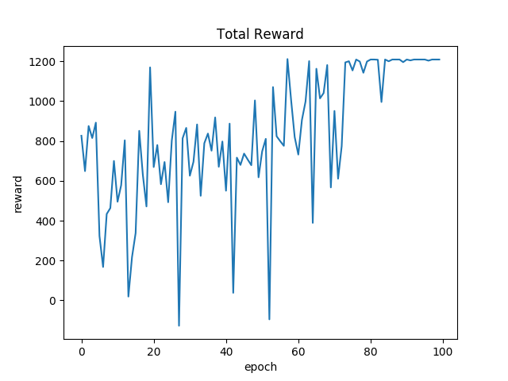
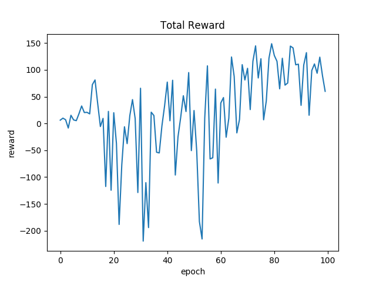
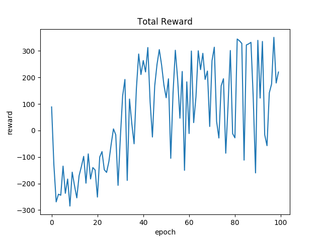

# DeepDoom: Navigating Complex Environments Using Hierarchical Deep Q-Networks


**Last Updated: March 4, 2016**

**DeepDoom Team:**

- [Rafael Zamora](https://github.com/rz4)
- [Lauren An](https://github.com/AtlasSoft-lsa3)
- [William Steele](https://github.com/billionthb) 
- [Joshua Hidayat](https://github.com/Arngeirr) 

### Table of Contents:
1. [Introduction](#introduction)
2. [DQN and Hierarchical DQN](#dqn-and-hierarchical-dqn)
3. [Scenarios](#scenarios)
 - [Rigid Turning](#scenario-1--rigid-turning)
 - [Exit Finding](#scenario-2--exit-finding)
 - [Switches](#scenario-3--switches)
 - [Doors](#scenario-4--doors)
4. [Results](#results)
5. [Getting Started](#getting-started)

## Introduction

Google DeepMind's landmark paper, [***Playing Atari With Deep Reinforcement
Learning***](https://www.cs.toronto.edu/~vmnih/docs/dqn.pdf), shows the feasibility of
game playing using only visual input. This was done by combining Deep Convolutional 
Neural Networks (CNNs) with Q-learning. Deep Q-Networks (DQNs) were able to learn and play 
2D Atari-2600 games such as Pong, Breakout, and Space Invaders. Since then, there has been 
much research into applying these same techniques in 3D environments such as 
[Minecraft](https://www.ijcai.org/Proceedings/16/Papers/643.pdf) and Doom.

[ViZDoom](https://arxiv.org/pdf/1605.02097.pdf) is a Doom based AI research platform
which allows us to test reinforcement learning techniques in Doom's 3D environment.
ViZDoom's Visual Doom AI Competition shows that AIs can be taught to play sufficiently
in the Doom environment using DQNs.

[Previous research](https://arxiv.org/pdf/1609.05521.pdf) done using ViZDoom has mainly
focused on combat with only a minor focus on navigation (*item/health pickups*). Navigation
is an important part in playing Doom, especially in single-player instances of the game.
Levels designed for human players are complex, requiring the player to use multiple
navigational behaviors throughout the level.

We propose a [hierarchical implementation](https://arxiv.org/pdf/1604.07255.pdf) of the Deep 
Q-Networks in order to learn complex navigational problems. DQN models are first trained on simple 
tasks and then integrated as sub-models in a Hierarchical-DQN model. This allows knowledge 
learned from the simple tasks to be used in training more complex tasks.

## DQN and Hierarchical-DQN
> Under Construction

### Q-Learning:

Reinforcement learning involves learning the best action to take at any given state through rewards recieved
from the environment. This process is commonly represented as a ***Markov Decision Process*** which is a finite 
sequence of states, actions and rewards:

- ***s<sub>0</sub>, a<sub>0</sub>, r<sub>0</sub>, ..., s<sub>n</sub>, a<sub>n</sub>, r<sub>n</sub>***

An agent situated in an environment has a set of available actions, each of which transforms the state of the
environment in some way. The agent must learn the best policy for choosing actions that will maximize the reward.

A good strategy for agents is to maximize the total future reward from the current time frame:

- ***R<sub>t</sub> = r<sub>t</sub> + r<sub>t+1</sub> + ... + r<sub>t+n</sub>***

In stochastic environments, its better to use a discounted total future reward:

- ***R<sub>t</sub> = r<sub>t</sub> + g r<sub>t+1</sub> + ... + g<sup>n-t</sup> r<sub>t+n</sub>***

***g*** is the discount factor between 0.0 and 1.0. If set to 0.0, the agent will only care about immediate reward.

***Q-learning*** defines a function ***Q(s,a)*** which represents the maximum possible future reward from preforming 
action ***a*** on state ***s*** and preforming optimally there after. In other words, the Q-function gives the 
"quality" of an action at a given state:

- ***Q(s<sub>t</sub>,a<sub>t</sub>) = max R<sub>t</sub>***

Knowing the Q-values, we can determine policy ***π(s)***:

- ***π(s) = argmax<sub>a</sub> Q(s,a)***

In order to approximate the ***Q(s,a)***, the ***Bellman Equation*** is used:

- ***Q(s,a) = Q(s,a) + α (r + g max<sub>a'</sub> Q(s',a') - Q(s,a))***

***α*** is the Q-learning rate between 0.0 and 1.0. If set to 0.0, Q-function remains the same.
Q-learning works by iteratively updating the Q-function using the ***Bellman Equation***.
In early stages of training the ***Q(s,a)*** approximation can be completely wrong, but given enough time
the function will converge and represent the true Q-values.

### Approximating Q-function with CNNs:

Earlier implementations of ***Q-learning*** used tables to store Q-values of all possible state-action pairs. This is 
not feasible for large state spaces like Doom. ***Convolutional Neural Networks*** have been very effective in the 
domain of image recognition. In simple terms, CNNs function by abstracting features from images and using those 
features to approximate the desired function. Google's Deepmind has shown that CNNs can be used to approximate 
Q-functions from visual pixel data.

The Deep network architecture implemented for this project is defined below:

> TODO: Make Layer Chart

In order to train the network, we used RMSprop as the optimization algorithm and the mean-squared as the loss
function.

### Replay Memory:

Approximating Q-values using non-linear function like CNNs can be unstable. ***Replay Memory*** reduces the chance
of getting stuck at a local minimum by using a random batch from a list of ***transitions*** to train the DQN.
Transitions are defined as:

- ***( s, a, r, s' )***

New Q-values are calculated using the batch and the ***Bellman Equation***, and then used to update the DQN.

### Exploration vs Exploitation:


### Hierarchical Q-Learning:


## Scenarios

We designed a set of scenarios where the agent will learn specific behaviors. These scenarios were created using Doom Builder v2.1+ and ViZDoom v1.1+. Reward functions are defined via the Doom Builder Script Editor using the Action Code Script (ACS) scripting language. For a quick tutorial, [click here](https://zdoom.org/wiki/ACS).

>***Note: living rewards are defined within the ViZDoom config file.***

The following are descriptions of the scenarios:

---

### Scenario 1 : Rigid Turning


#### Description:
 - The purpose of this scenario is to train the agent how to navigate through corridors with sharp 90° turns.
 - The map is a rigid 2-shape, with randomly determined ceiling, floor, and wall textures at the time of loading the map.
 - The agent is placed at one end of the '2' and is expected to navigate through this shape.
 - The agent gets rewarded for walking down a corridor and turning a 90° corner.
 - The agent gets penalized for bumping into walls and not moving.

#### Available Actions:
 - [MOVE_FORWARD, MOVE_BACKWARD, TURN_LEFT, TURN_RIGHT]
 - This set of actions is the minimum required to complete the rigid turning scenario.

#### Goal Function:

 - **+60** turning linedefs - for turning a 90° corner
 - **+20** walking linedefs - for walking down a corridor
 
 - **+100** level exit - for completing the level
 - **+1** moving reward - changes in the agent's x,y position to encourage continual movement

 - **-10** hitting the walls - for aimlessly bumping into the walls
 - **-1** living reward - ViZDoom config file penalty to encourage faster level completion

#### Files:
 - [rigid_turning.wad](src/wads/rigid_turning.wad)
 - [rigid_turning.cfg](src/configs/rigid_turning.cfg)

---

### Scenario 2 : Exit Finding


#### Description:
 - The purpose of this scenario is to train the agent how to locate an exit from a room and move towards that exit, which is merely a long hallway branching off of the room.
 - The map is a square room with a long 128-unit-wide corridor leading out of it and randomly determined ceiling, floor, and wall textures at the time of loading the map.
 - The agent is placed at a random point inside the room and facing a random direction via a ZDoom ACS script that runs when the agent enters the map.
 - The agent gets rewarded for moving towards the exit when it is within a 21.6° field of view relative to the agent's direction; therefore, the agent does not get rewarded for moving towards the exit while facing away.
 - The agent gets penalized for bumping into walls and not moving.

#### Available Actions:
 - [MOVE_FORWARD, MOVE_BACKWARD, TURN_LEFT, TURN_RIGHT]
 - This set of actions is the minimum required to complete the exit finding scenario.

#### Goal Function:

 - **+10 * (x)** exit linedefs - for moving closer to the goal while looking at it
 
>***Note: x inversely corresponds to the switch's distance; x decreases as distance increases.***

 - **+100** level exit - for completing the level
 - **+1** moving reward - changes in theagent's x,y position to encourage continual movement

 - **-10** hitting the walls - for aimlessly bumping into the walls
 - **-1** living reward - ViZDoom config file penalty to encourage faster level completion

#### Files:
 - [exit_finding.wad](src/wads/exit_finding.wad)
 - [exit_finding.cfg](src/configs/exit_finding.cfg)

---

### Scenario 3 : Switches


#### Description:
 - The purpose of this scenario is to train the agent how to locate a switch on the wall.
 - The map is a square room with a button placed on the south wall and randomly determined ceiling, floor, and wall textures at the time of loading the map.
 - The agent is placed at a random point inside the room and facing a random direction via a ZDoom ACS script that runs when the agent enters the map.
 - The agent gets rewarded for moving towards the switch when it is within a 21.6° field of view relative to the agent's direction; therefore, the agent does not get rewarded for moving towards the exit while facing away.
 - The agent gets penalized for not moving.

#### Available Actions:
 - [USE, MOVE_FORWARD, MOVE_BACKWARD, TURN_LEFT, TURN_RIGHT]
 - This set of actions is the minimum required to complete the switches scenario.
 
>***Note: the USE action is defined at the beginning of the action list to ensure indexing consistency.***

#### Goal Function:

 - **+10 * (x)** exit linedefs - for moving closer to the goal while looking at it
 
>***Note: x inversely corresponds to the switch's distance; x decreases as distance increases.***

 - **+100** pressing the switch - for completing the level
 - **+1** moving reward - changes in the agent's x,y position to encourage continual movement
 
 - **-1** living reward - ViZDoom config file penalty to encourage faster level completion

#### Files:
 - [Switches.wad](src/wads/Switches.wad)
 - [Switches.cfg](src/configs/switches.cfg)

---

### Scenario 4 : Doors


#### Description:
 - The purpose of this scenario is to train the agent how to recognize and open doors.
 - The map is a straight rectangular corridor with 9 doors placed inside it and randomly determined ceiling, floor, and wall textures at the time of loading the map.
 - The agent is placed at one end of this corridor and is expected to proceed straight towards the exit.
 - The agent gets rewarded for advancing towards doors, for advancing through opened doors, and for reaching the exit.
 - The agent gets penalized for not moving.

#### Available Actions:
 - [USE, MOVE_FORWARD]
 - This set of actions is the minimum required to complete the doors scenario.

#### Goal Function:

 - **+50** door linedefs - for passing through an open door
 - **+10** walking linedefs - for walking towards the next door
 
 - **+20** level exit - for completing the level
 - **+1** moving reward - changes in the agent's x,y position to encourage continual movement
 
 - **-1** living reward - ViZDoom config file penalty to encourage faster level completion

#### Files:
 - [Doors.wad](src/wads/Doors.wad)
 - [Doors.cfg](src/configs/doors.cfg)

---

## Results

> Under Construction

The DQN and HDQN models were trained on a machine with the following specs:

```
Intel i7-920
Asus Rampage GENE II (Intel X58 Chipset)
12 GB DDR3 10600
Nvidia GTX 750 Ti (2 GB VRAM)
SanDisk SSD Plus 240GB
```


The performance of the models are measured by averaging the total reward over 100 test runs after each training 
epoch. A demonstration of each trained model in their respective training scenario is also provided.

#### Comments and Observations:

- A +1 moving reward helped to prevent agent from spinning in a stationary position.
- A linear alpha (Q-learning rate) decay helped converge model behavior.

---

### Rigid Turning

Rigid Turning training parameters can be found [here](doc/parameters/rigid_turning.md).

#### Average Total Reward Per Epoch:



#### Demo:

[](http://www.youtube.com/watch?v=i4tsydC4u1s)

---

### Exit Finding

Exit Finding training parameters can be found [here](doc/parameters/exit_finding.md).

#### Average Total Reward Per Epoch:



#### Demo:

[](http://www.youtube.com/watch?v=3_Cgei2Z3FE)

---

### Doors

Doors training parameters can be found [here](doc/parameters/doors.md).

#### Average Total Reward Per Epoch:



#### Demo:

[](http://www.youtube.com/watch?v=SDnrMJ6Y6JE)

## Getting Started

### Requirements:

Requires Python v3.5+.

Requires the following Python Packages:

- [ViZDoom v1.1.1+](https://github.com/Marqt/ViZDoom)

- [Keras v1.2.2+](https://github.com/fchollet/keras)

- [TensorFlow v1.0+](https://tensorflow.org/)

- [H5Py v2.6+](https://h5py.org/)

- [Matplotlib v2.0+](http://matplotlib.org/)

### Setup and Installation:

Download or clone repository and install required packages.

>**Important:** keras.json configuration file (located in ~/.keras/) should be set to
>the following:

```json
{
    "floatx": "float32",
    "epsilon": 1e-07,
    "backend": "tensorflow",
    "image_dim_ordering": "th"
}
```

### Testing Models:

>*Model Weights currently unavailable*

You can test out the different trained models by changing the testing parameters
in [`Test.py`](src/Test.py):

```python

# Testing Parameters
scenario = 'configs/rigid_turning.cfg'  # Vizdoom Scenario
model_weights = "rigid_turning.h5"      # DQN Model Weights .h5 file
depth_radius = 1.0                      # Depth Buffer Radius (recommended to keep at 1.0)  
depth_contrast = 0.9                    # Depth Buffer contrast on Greyscaled image
test_param = {
    'frame_skips' : 6,                  # Number of frames same action
    'nb_frames' : 3                     # Number of previous frames model uses
}
nb_runs = 10                            # Number of Testing runs done on model

```
> **Caution:** Certain `model_weight` files are not compatible with specific scenarios.
> Also, make sure `nb_frames` are compatible with *model_weight* file.
> For more information, please refer to parameter descriptions located in [/doc/parameters/](doc/parameters)

From [`/src/`](src) run [`Test.py`](src/Test.py):

```
$python3 Test.py
Using TensorFlow backend.
Testing DQN-Model: rigid_turning.h5

Running Simulation: configs/rigid_turning.cfg
 66%|█████████████████████████▌             | 197/300 [00:01<00:00, 160.48it/s]
Total Score: 1209.0

Running Replay: test.lmp
Total Score: 1209.0

```
The following is the ViZDoom `test.lmp` replay:


### Wads, ViZdoom Configs, and Model Weights:

The [`/src/wads/`](src/wads) folder contains the `.wad` files for the scenarios.

The [`/src/configs/`](src/configs) folder contains the `.cfg` files for the scenarios.

The [`/data/model_weights`](data/model_weights) folder contains trained `.h5` model
weight files.

## License
Deep Doom Project is under the MIT License.
