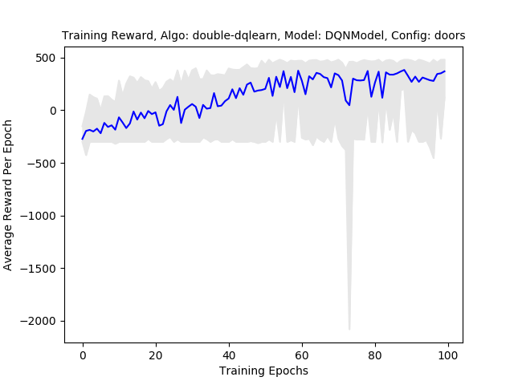

# DeepDoom: Navigating 3D Environments Visually Using Distilled Hierarchical Deep Q-Networks


**Last Updated: April 2, 2016**

**DeepDoom Team:**

- [Rafael Zamora](https://github.com/rz4)
- [Lauren An](https://github.com/AtlasSoft-lsa3)
- [William Steele](https://github.com/billionthb)
- [Joshua Hidayat](https://github.com/Arngeirr)

### Table of Contents:
1. [Introduction](#introduction)
2. [Scenarios](#scenarios)
 - [Rigid Turning](#scenario-1--rigid-turning)
 - [Exit Finding](#scenario-2--exit-finding)
 - [Doors](#scenario-3--doors)
3. [Results](#results)
4. [Getting Started](#getting-started)

## Introduction

Despite improvements to game-playing Artificial Intelligence (AI), game AI rely on looking
“under the hood” of their respective games in order to gain access to the various internal variables,
thus holding an unfair advantage over their human counterparts. However, ally and enemy NPCs (non-playable characters)
are typically designed to keep the human player engaged with a fair challenge. When set on easier difficulty settings,
AI are typically considered “pushovers,” while on harder difficulty settings, they are capable of playing near “perfect.”
In order to design a more balanced and enjoyable experience, it may be more suitable for agents to behave similar to
a human player using the same available environmental information.

Google DeepMind’s paper, [Playing Atari With Deep Reinforcement Learning](https://www.cs.toronto.edu/~vmnih/docs/dqn.pdf),
shows the feasibility of game playing using only visual input. This was done by combining Deep Convolutional Neural
Networks (CNNs) with Q-Learning, forming Deep Q-Networks (DQNs). Agents trained via DQNs were able to learn and play
two-dimensional (2D) Atari 2600 games such as Pong, Breakout, and Space Invaders. In other words, DQNs guided the agent
towards the best policy using positive or negative responses from the game’s respective environments. Since then, there
has been an ample amount of research into applying these same reinforcement learning techniques to train agents within
three-dimensional (3D) environments such as [Minecraft](https://www.ijcai.org/Proceedings/16/Papers/643.pdf) and Doom.

The Doom series began in 1993 with the release of the first game, DOOM, and it has since sparked
countless adaptations of 3D first-person shooter (FPS) games. These environments heightened the level design complexity
with the incorporation of depth, providing another factor when designing agents. The relevancy of Doom with Artificial
Intelligence can be contributed to the AI research platform [ViZDoom](https://arxiv.org/pdf/1605.02097.pdf) alongside
the scenario customization software Doom Builder and Slade (of which we used Doom Builder). ViZDoom allows programmers
to test reinforcement learning techniques within the environment of Doom. Its Visual Doom AI Competitions, as well as
[previous research](https://arxiv.org/pdf/1609.05521.pdf), proved the feasibility of teaching agents to sufficiently
play Doom using DQNs. However, they mainly focused on the combat aspect of Doom, with only a minor focus on the
navigation aspect (via item and health pickups).

For our capstone project, we created an agent capable of solving complex navigational problems using a
[hierarchical implementation](https://arxiv.org/pdf/1604.07255.pdf) of the Deep Q-Networks, expanding on ViZDoom’s
experimentations except with a heavier focus on navigation. We first utilized DQN models to separately train
simple tasks (such as turning and finding exits) and then integrated these as sub-models in a Hierarchical
Deep Q-Network (h-DQN) model. In addition, we distilled, or compressed, trained h-DQN models
into the simple DQN architecture for a more resource-efficient execution. Increasingly-complex behaviors were achieved 
by incrementally-aggregating distilled h-DQN models with other skills into other Hierarchical-DQN models,
reflecting our goal of developing a more visually fit Doom-playing Artificial Intelligence.

For more information, [DeepDoom: Navigating 3D Environments Visually Using Distilled Hierarchical Deep Q-Networks](DeepDoom_Paper.pdf)

## Scenarios

We designed a set of scenarios where the agent will learn specific behaviors.
These scenarios were created using Doom Builder v2.1+ and ViZDoom v1.1+.
Reward functions are defined via the Doom Builder Script Editor using the Action Code Script (ACS) scripting language.
For a quick tutorial, [click here](https://zdoom.org/wiki/ACS).

>***Note: living rewards are defined within the ViZDoom config file.***

The following are descriptions of the scenarios:

---

### Scenario 1 : Rigid Turning


#### Description:
 - The purpose of this scenario is to train the agent how to navigate through corridors with sharp 90° turns.
 - The map is a rigid 2-shape, with randomly determined ceiling, floor, and wall textures at the time of loading the map.
 - The agent is placed at one end of the '2' and is expected to navigate through this shape.
 - The agent gets rewarded for walking down a corridor and turning a 90° corner.
 - The agent gets penalized for bumping into walls and not moving.

#### Available Actions:
 - [MOVE_FORWARD, MOVE_BACKWARD, TURN_LEFT, TURN_RIGHT]
 - This set of actions is the minimum required to complete the rigid turning scenario.

#### Goal Function:

 - **+60** turning linedefs - for turning a 90° corner
 - **+20** walking linedefs - for walking down a corridor

 - **+100** level exit - for completing the level
 - **+1** moving reward - changes in the agent's x,y position to encourage continual movement

 - **-10** hitting the walls - for aimlessly bumping into the walls
 - **-1** living reward - ViZDoom config file penalty to encourage faster level completion

#### Files:
 - [rigid_turning.wad](src/wads/rigid_turning.wad)
 - [rigid_turning.cfg](src/configs/rigid_turning.cfg)

---

### Scenario 2 : Exit Finding


#### Description:
 - The purpose of this scenario is to train the agent how to locate an exit from a room and move towards that exit, which is merely a long hallway branching off of the room.
 - The map is a square room with a long 128-unit-wide corridor leading out of it and randomly determined ceiling, floor, and wall textures at the time of loading the map.
 - The agent is placed at a random point inside the room and facing a random direction via a ZDoom ACS script that runs when the agent enters the map.
 - The agent gets rewarded for moving towards the exit when it is within a 21.6° field of view relative to the agent's direction; therefore, the agent does not get rewarded for moving towards the exit while facing away.
 - The agent gets penalized for bumping into walls and not moving.

#### Available Actions:
 - [MOVE_FORWARD, MOVE_BACKWARD, TURN_LEFT, TURN_RIGHT]
 - This set of actions is the minimum required to complete the exit finding scenario.

#### Goal Function:

 - **+10 * (x)** exit linedefs - for moving closer to the goal while looking at it

>***Note: x inversely corresponds to the switch's distance; x decreases as distance increases.***

 - **+100** level exit - for completing the level
 - **+1** moving reward - changes in theagent's x,y position to encourage continual movement

 - **-10** hitting the walls - for aimlessly bumping into the walls
 - **-1** living reward - ViZDoom config file penalty to encourage faster level completion

#### Files:
 - [exit_finding.wad](src/wads/exit_finding.wad)
 - [exit_finding.cfg](src/configs/exit_finding.cfg)

---

### Scenario 3 : Doors


#### Description:
 - The purpose of this scenario is to train the agent how to recognize and open doors.
 - The map is a straight rectangular corridor with 9 doors placed inside it and randomly determined ceiling, floor, and wall textures at the time of loading the map.
 - The agent is placed at one end of this corridor and is expected to proceed straight towards the exit.
 - The agent gets rewarded for advancing towards doors, for advancing through opened doors, and for reaching the exit.
 - The agent gets penalized for not moving.

#### Available Actions:
 - [USE, MOVE_FORWARD, TURN_LEFT, TURN_RIGHT]
 - This set of actions is the minimum required to complete the doors scenario.

#### Goal Function:

 - **+50** door linedefs - for passing through an open door
 - **+10** walking linedefs - for walking towards the next door

 - **+20** level exit - for completing the level
 - **+1** moving reward - changes in the agent's x,y position to encourage continual movement

 - **-1** living reward - ViZDoom config file penalty to encourage faster level completion

#### Files:
 - [Doors.wad](src/wads/Doors.wad)
 - [Doors.cfg](src/configs/doors.cfg)

---

## Results

> Under Construction

The DQN and HDQN models were trained on a machine with the following specs:

```
Intel i7-920
Asus Rampage GENE II (Intel X58 Chipset)
12 GB DDR3 10600
Nvidia GTX 750 Ti (2 GB VRAM)
SanDisk SSD Plus 240GB
```

The performance of the models are measured by averaging the total reward over 100 test runs after each training
epoch. A demonstration of each trained model in their respective training scenario is also provided.

#### Comments and Observations:

- A +1 moving reward helped to prevent agent from spinning in a stationary position.
- A linear alpha (Q-learning rate) decay helped converge model behavior.

---

### Rigid Turning

Rigid Turning training parameters can be found [here](doc/parameters/rigid_turning.md).

#### Average Total Reward Per Epoch:


#### Demo:

[](http://www.youtube.com/watch?v=i4tsydC4u1s)

---

### Exit Finding

Exit Finding training parameters can be found [here](doc/parameters/exit_finding.md).

#### Average Total Reward Per Epoch:


#### Demo:

[](http://www.youtube.com/watch?v=3_Cgei2Z3FE)

---

### Doors

Doors training parameters can be found [here](doc/parameters/doors.md).

#### Average Total Reward Per Epoch:



#### Demo:

[](http://www.youtube.com/watch?v=SDnrMJ6Y6JE)

---

### All Navigation Skills

All Navigation Skills training parameters can be found [here](doc/parameters/all_skills.md).

#### Average Total Reward Per Epoch:


#### Demo:

---

### Distilled All Navigation Skills

Distilled All Navigation Skills training parameters can be found [here](doc/parameters/distilled_all_skills.md).

#### Average Total Reward Per Epoch:


#### Demo:

---

### Shooting

Shooting training parameters can be found [here](doc/parameters/shooting.md).

#### Average Total Reward Per Epoch:


#### Demo:

## Getting Started

### Requirements:

Requires Python v3.5+.

Requires the following Python Packages:

- [ViZDoom v1.1.1+](https://github.com/Marqt/ViZDoom)

- [Keras v1.2.2+](https://github.com/fchollet/keras)

- [TensorFlow v1.0+](https://tensorflow.org/)

- [H5Py v2.6+](https://h5py.org/)

- [Matplotlib v2.0+](http://matplotlib.org/)

### Setup and Installation:

Download or clone repository and install required packages.

### Testing Models:

>*Model Weights currently unavailable*

You can test out the different trained models by changing the testing parameters
in [`Test.py`](src/Test.py):

```python

# Testing Parameters
scenario = 'configs/rigid_turning.cfg'  # Vizdoom Scenario
model_weights = "double_dqlearn_DQNModel_rigid_turning.h5"      # DQN Model Weights .h5 file
depth_radius = 1.0                      # Depth Buffer Radius (recommended to keep at 1.0)  
depth_contrast = 0.9                    # Depth Buffer contrast on Greyscaled image
test_param = {
    'frame_skips' : 6,                  # Number of frames same action
    'nb_frames' : 3                     # Number of previous frames model uses
}
nb_runs = 10                            # Number of Testing runs done on model

```
> **Caution:** Certain `model_weight` files are not compatible with specific scenarios.
> Also, make sure `nb_frames` are compatible with *model_weight* file.
> For more information, please refer to parameter descriptions located in [/doc/parameters/](doc/parameters)

From [`/src/`](src) run [`Test.py`](src/Test.py):

```
/DeepDoom/src $python3 Test.py
Using TensorFlow backend.
Testing DQN-Model: rigid_turning.h5

Running Simulation: configs/rigid_turning.cfg
 66%|█████████████████████████▌             | 197/300 [00:01<00:00, 160.48it/s]
Total Score: 1209.0

Running Replay: test.lmp
Total Score: 1209.0

```
The following is the ViZDoom `test.lmp` replay:


### Wads, ViZdoom Configs, and Model Weights:

The [`/src/wads/`](src/wads) folder contains the `.wad` files for the scenarios.

The [`/src/configs/`](src/configs) folder contains the `.cfg` files for the scenarios.

The [`/data/model_weights`](data/model_weights) folder contains trained `.h5` model
weight files.

## License
Deep Doom Project is under the MIT License.
